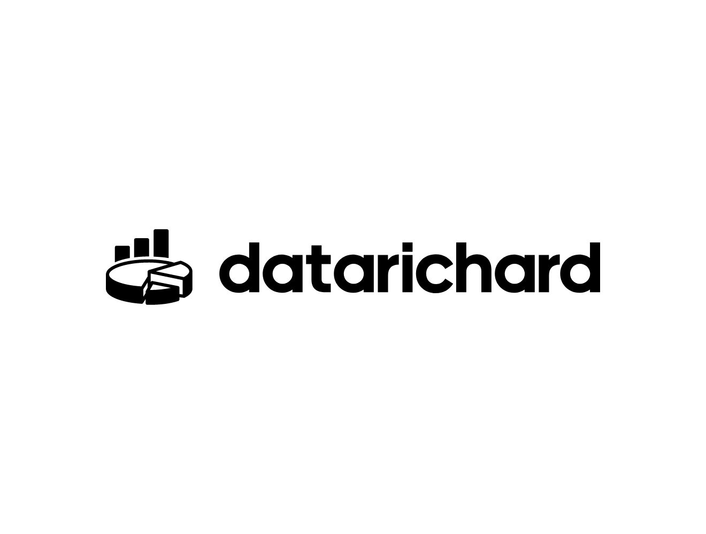

# 데이터 교육 크리에이터

- Python
- R
- AWS
- Power BI
- SQL
- Excel
- Business Analytics
- Data Engineering

와 관련된 **(라이브 강의, 온라인 클래스, 교육 컨텐츠)** 를 만듭니다.

## 소개 (Introduction)

- 📊데이터로 성장하고 싶은 탐험가들이 더욱 재미있고 가치있게 배울수 있게 돕는 
교육 크리에이터, 리차드입니다.
- 📖 심리학과에서 시작하여 
📊데이터 분석가 와 🔧데이터 엔지니어로 근무한 후,
현재는 📺 데이터 교육 크리에이터로 활동하고 있어요.

## 교육 (Education)

🏫 **MSBA(Master of Business Analytics)**

- University of Utah - David Eccles School of Business

🏫 **Bachelor's of Data Science**
- Brigham Young University - Idaho
